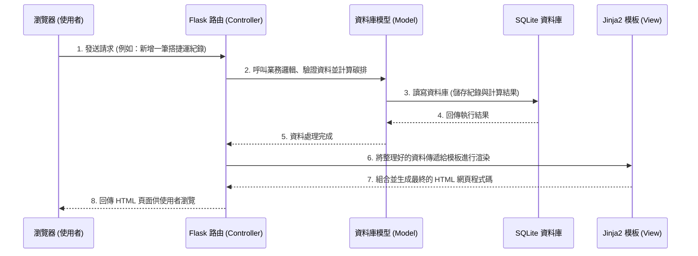

# 系統架構：數位足跡-碳排放行為帳本

## 1. 技術架構說明

本專案採用輕量級的網頁應用程式架構，不採取前後端分離模式，而是由後端直接渲染 HTML 頁面。這有助於快速開發與迭代，並維持良好的效能。

- **後端框架：Python + Flask**
  - **選擇原因**：Flask 是一個輕量、易上手的微框架，非常適合用來建立小至中型的應用程式。
  - **Controller（控制器）**：負責接收使用者的 HTTP 請求（如提交記帳表單），處理業務邏輯（如計算碳排放量），並決定要回傳哪個畫面或資料。
- **視圖（View）：Jinja2 模板引擎**
  - **選擇原因**：內建於 Flask，允許在 HTML 中動態插入變數與控制流程（例如顯示使用者的碳足跡報表清單），可以輕鬆建立動態網頁。
- **資料庫（Model）：SQLite**
  - **選擇原因**：不需要額外安裝資料庫伺服器，資料儲存在單一檔案中，開發與部署極為便利，非常適合本專案的使用情境。

## 2. 專案資料夾結構

本專案將採用以下資料夾結構，將程式碼分層管理，以保持專案的整潔與可維護性：

```text
four/
├── app/
│   ├── __init__.py      # 初始化 Flask 應用程式與載入設定
│   ├── models/          # 資料庫模型 (Model) - 定義資料表結構與關聯
│   │   └── user_data.py # 使用者資料表、行為紀錄表等定義
│   ├── routes/          # 路由與控制器 (Controller) - 處理各頁面的請求
│   │   ├── auth.py      # 處理註冊、登入、登出邏輯
│   │   ├── ledger.py    # 處理行為登入、碳排計算、建議推播邏輯
│   │   └── report.py    # 處理數據視覺化報表與目標追蹤邏輯
│   ├── templates/       # HTML 模板 (View) - 使用 Jinja2 語法
│   │   ├── base.html    # 共用的網頁外觀排版與導覽列
│   │   ├── login.html   # 登入與註冊頁面
│   │   ├── index.html   # 首頁 / 個人主控制台 (Dashboard)
│   │   └── record.html  # 行為登錄與建議頁面
│   └── static/          # 靜態資源檔案
│       ├── css/         # 網頁樣式表 (style.css 等)
│       ├── js/          # 前端互動邏輯 (如觸發圖表繪製)
│       └── images/      # 圖片與圖示資源
├── instance/
│   └── database.db      # SQLite 實體資料庫檔案 (不會進入 Git 版控)
├── docs/                # 專案文件
│   ├── PRD.md           # 產品需求文件
│   └── ARCHITECTURE.md  # 系統架構文件
├── requirements.txt     # Python 依賴套件清單 (Flask, etc.)
└── app.py               # 專案的啟動入口點
```

## 3. 元件關係圖

以下使用 Mermaid 語法展示系統中各主要元件之間的互動流程：



## 4. 關鍵設計決策

1. **整合渲染而非前後端分離**
   - **原因**：考量到專案規模與開發時程，採用 Flask + Jinja2 進行伺服器端渲染 (SSR) 能夠減少 API 介面設計與前端框架（如 React/Vue）串接的溝通成本，讓團隊更專注在核心的減碳邏輯實現。
2. **模組化的路由設計 (Blueprints)**
   - **原因**：將不同功能的路由分類成多個檔案（如 `auth.py`, `ledger.py`, `report.py`），避免所有的程式碼擠在同一個檔案中。此作法可提升程式碼的可讀性，也方便未來擴充與團隊成員協作開發。
3. **靜態資料驅動的碳排放計算與建議**
   - **原因**：為達成「自動計算碳排」與「低碳替代建議」功能，系統將內建一套**碳排放係數對照表**（例如：搭捷運 - 每公里 0.04kg CO2e，開車 - 每公里 0.25kg CO2e）。在使用者送出行為當下，系統即時比對計算並存入資料庫，維持高效率。
4. **前端圖表渲染交由 JavaScript 套件處理**
   - **原因**：雖然採用伺服器端渲染，但將視覺化圖表的繪製（例如使用 Chart.js）保留在前端執行，後端僅傳遞計算好的統計數據。這樣不僅減輕伺服器繪圖負擔，也能提供更順暢的圖表互動體驗。
