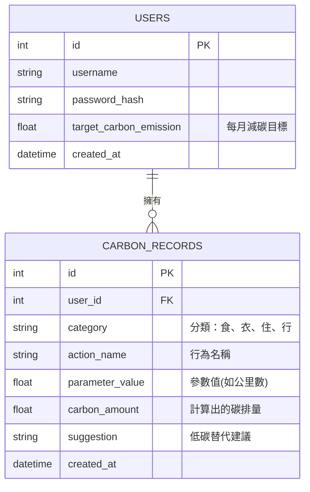

# 資料庫設計：數位足跡-碳排放行為帳本

## 1. ER 圖（實體關係圖）

## 2. 資料表詳細說明

### USERS (使用者資料表)
儲存系統使用者的基本資訊與減碳目標設定。

| 欄位名稱 | 型別 | 必填 | 說明 |
| :--- | :--- | :--- | :--- |
| `id` | INTEGER | 是 | Primary Key，自動遞增 |
| `username` | TEXT | 是 | 使用者名稱/帳號，必須唯一 (UNIQUE) |
| `password_hash` | TEXT | 是 | 經過加密的密碼 |
| `target_carbon_emission` | REAL | 否 | 使用者自訂的每月碳排放目標基準 (預設 0) |
| `created_at` | DATETIME | 是 | 帳號建立時間 (預設 CURRENT_TIMESTAMP) |

### CARBON_RECORDS (碳排紀錄表)
紀錄使用者在系統上登錄的每一筆活動，並保存計算後的結果與建議。

| 欄位名稱 | 型別 | 必填 | 說明 |
| :--- | :--- | :--- | :--- |
| `id` | INTEGER | 是 | Primary Key，自動遞增 |
| `user_id` | INTEGER | 是 | Foreign Key，對應 `users.id`，若刪除使用者則級聯刪除 |
| `category` | TEXT | 是 | 行為的四大分類 (如：食、衣、住、行) |
| `action_name` | TEXT | 是 | 行為名稱 (如：搭乘捷運、獨自開車) |
| `parameter_value` | REAL | 是 | 使用者輸入的參數值 (如：距離 10 公里) |
| `carbon_amount` | REAL | 是 | 根據係數表計算出的碳排或減碳量數值 |
| `suggestion` | TEXT | 否 | 系統即時提供的低碳替代建議 (可能為空) |
| `created_at` | DATETIME | 是 | 紀錄發生時間 (預設 CURRENT_TIMESTAMP) |

## 3. 實作說明
- SQL 建表腳本位於 `database/schema.sql`。
- 本專案採用原生的 `sqlite3` 模組，Model 程式碼位於 `app/models/` 資料夾，封裝了標準的 CRUD 靜態方法供 Controller 呼叫。
