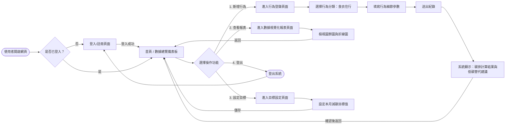
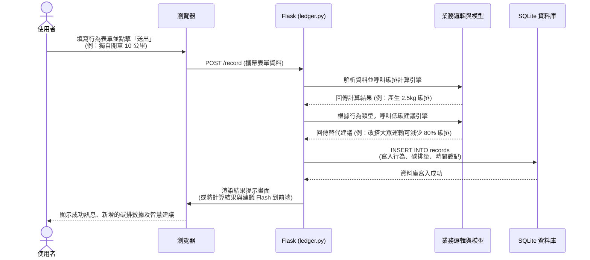

# 流程圖：數位足跡-碳排放行為帳本

本文件根據專案需求與架構設計，呈現「使用者操作流程」與「系統資料互動序列」，幫助開發團隊清楚理解功能串接邏輯。

## 1. 使用者流程圖（User Flow）

此圖表展示使用者從開啟網頁到進行各項操作（如登錄行為、查看報表、設定目標）的完整路徑。

## 2. 系統序列圖（Sequence Diagram）

以下針對核心功能**「新增行為紀錄、計算碳排並獲得建議」**，描述前端瀏覽器、後端控制器與資料庫之間的資料流動。

## 3. 功能清單與路由對照表

本表列出系統主要功能對應的 URL 路徑與 HTTP 請求方法，作為後續 API 設計與前後端串接的參考依據。

| 功能模組 | 功能名稱 | URL 路徑 | HTTP 方法 | 說明 |
| :--- | :--- | :--- | :--- | :--- |
| **會員驗證** | 使用者註冊 | `/register` | `GET`, `POST` | `GET`: 顯示註冊表單 `POST`: 處理註冊邏輯 |
| | 使用者登入 | `/login` | `GET`, `POST` | `GET`: 顯示登入表單 `POST`: 處理登入邏輯 |
| | 使用者登出 | `/logout` | `GET` | 清除 Session 並導回登入頁 |
| **數據總覽** | 首頁 / 儀表板 | `/` | `GET` | 顯示個人累積碳足跡、目標達成進度 |
| **行為帳本** | 登錄行為 | `/record` | `GET`, `POST` | `GET`: 顯示行為登錄介面 `POST`: 接收資料，計算碳排並儲存 |
| | 刪除行為紀錄 | `/record/<id>/delete` | `POST` | 刪除錯誤輸入的歷史紀錄 |
| **統計報表** | 數據視覺化 | `/report` | `GET` | 顯示以週或月為單位的圖表數據 (折線圖/圓餅圖) |
| **目標管理** | 設定減碳目標 | `/target` | `GET`, `POST` | 設定或修改個人每月的減碳目標基準 |
